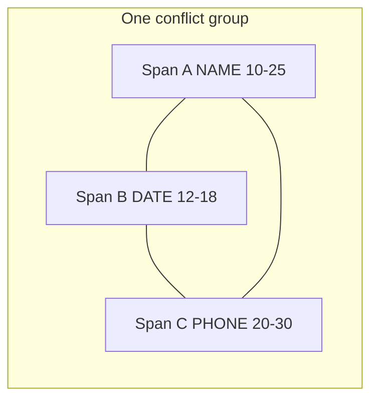

# Design: overlap conflict resolution (frontend-production)

> Status: hardened after review (2026-04-26). Changes from v1: range-key
> primitives replaced with group-id primitives; "longest wins" reuses
> `mergeLabelPrioritySpans` with an empty priority list; "leftmost-first"
> sort key fixed to `(start asc, length asc)`; the highlighter overlap
> overlay is rebuilt as a per-character coverage pass (the existing
> exact-range overlay is retired); auto-resolve clears `resolved` and
> stamps `lastAutoResolve` on the file; tests deferred — `frontend-production`
> has no test runner today.

## Goals

- Treat **any character-level overlap** between spans as a **conflict** (not only identical `[start, end)` with different labels).
- Let reviewers **inspect each conflict**, **keep one span** (drop the rest in that group) or **drop all spans** in the group.
- Offer **bulk "resolve all"** strategies aligned with backend behavior where possible.
- Optional **"auto-resolve after detection"** before spans are committed to the dataset state.

### Non-goals (v1)

Automatic merge of labels, splitting spans, or editing boundaries inside the conflict panel (users can still resize spans elsewhere).

---

## 1. Conflict model

**Definition:** Two spans conflict if they overlap on the half-open interval `[start, end)` using the same rule as the backend:

`a.start < b.end && b.start < a.end`

**Conflict group:** Build an undirected graph (vertices = spans, edges = overlap) and union-find connected components. Each component with **more than one** span is one **overlap group**.

```ts
interface OverlapGroup {
  id: string;                       // stable: `g${minStart}-${maxEnd}-${memberCount}-${firstKey}`
  members: EntitySpanResponse[];    // every span in the component (duplicates included)
  minStart: number;                 // min(member.start)
  maxEnd: number;                   // max(member.end)
  excerpt: string;                  // originalText.slice(minStart, maxEnd) — display only
}
```

**Group identity is by member set, not by range.** A chained conflict (A 10–25, B 12–18, C 20–30) has `minStart=10`, `maxEnd=30`, **but no member span occupies [10, 30)** — so `${start}-${end}` is *not* a usable key. That is the central change from the v1 plan: every primitive now operates on the group, not on a range.

**Ordering groups:** Sort by `(minStart, maxEnd)` for stable navigation.

**Duplicates:** Exact duplicates (same start, end, label, source) are *members* like any other span. Resolving "keep one" via the group primitive removes every other member, so duplicates are dropped automatically.

This generalizes the current production behavior from `findConflictSets` (exact range + different labels only). The exact-range case becomes a **subset**: a small group where all members share one range.



---

## 2. Review UI (per document)

### 2.1 Surfaces

| Surface | Purpose |
|--------|---------|
| **Spans panel** (extend `SpanEditor`) | Primary: list overlap groups, controls to resolve. |
| **Source highlighter** | Render multi-cover offsets as a "conflict strip" segment; click jumps to the group. |
| **Header / badge** | e.g. `3 conflicts` next to span count; warn before surrogate save. |

### 2.2 Per-group block

For each `OverlapGroup`:

- **Title:** `Conflict · chars [minStart–maxEnd)` + truncated `excerpt`.
- **Rows:** one row per member span — label badge, `[start–end)`, optional confidence/source, monospace text snippet.
- **Actions:**
  - Radio: **Keep this span** (default = `pickPrimarySpan(group.members)`).
  - **Drop all spans in this group** (explicit; visually destructive).
- **Secondary:** "Scroll to range" / "Focus on source".

Resolution primitives — **all by group**, never by range:

- **Keep one:** `keepInOverlapGroup(spans, group, kept)` removes every member of `group` (by `entitySpanKey`) **except** `kept`, then re-inserts `kept`.
- **Drop all:** `dropOverlapGroup(spans, group)` removes every member.

State updates flow through existing `updateFile` / `onChange`.

### 2.3 Highlighter behavior

Today `buildSegments` skips overlapping spans (`SpanHighlighter.tsx:64` — `if (span.start < cursor) continue;`), which silently hides chained partial overlaps. The exact-range props (`overlapConflictRangeKeys` / `overlapSpanCandidatesByRange`) only catch identical-range cases — they cannot represent chains where no two spans share `[start, end)`.

**Replacement:** rewrite `buildSegments` as an event-sweep that returns three segment kinds:

```ts
type Segment =
  | { kind: 'plain'; start: number; end: number; text: string }
  | { kind: 'span'; start: number; end: number; text: string; span: EntitySpanResponse }
  | { kind: 'overlap'; start: number; end: number; text: string; spans: EntitySpanResponse[] };
```

Iterate over unique sorted `[start, end)` boundaries. Between two adjacent boundaries, the set of covering spans is constant — emit one segment per region with `|covering| ∈ {0,1,2+}`. Overlap segments render as a neutral hatched strip (rose tint), with a tooltip listing labels and `onClick` → focus the group.

This retires the exact-range overlay props on `SpanHighlighter`. The new prop is a single `overlapGroupById?: Map<string, OverlapGroup>` (used purely for click routing — group lookup is keyed by group id, recovered from a per-segment tag).

Phase 2 (optional, deferred): layered marks with opacity for accessibility.

---

## 3. Bulk resolve (whole document)

Add a control in the Spans panel: **"Resolve all conflicts"** with a **strategy** dropdown and **Apply**.

| Strategy | Sort key | Greedy keep | Backend parity | Implementation |
|----------|----------|-------------|----------------|----------------|
| **Label priority** *(default)* | label rank, then length desc, then leftmost | walk sorted; keep if doesn't overlap kept | matches `resolve_spans` strategy `label_priority` | `mergeLabelPrioritySpans(spans, RESOLVE_SPANS_LABEL_PRIORITY)` (existing) |
| **Longest wins** | length desc, then leftmost | same | matches `tag_replace` longest-first tie | `mergeLabelPrioritySpans(spans, [])` — empty priority makes label rank uniform, so length becomes primary key |
| **Leftmost first** | start asc, then **length asc** (shorter wins ties) | same | favors earlier, shorter detections | new tiny helper |

`(start asc, length asc)` was misstated in the v1 plan as `-length` — that is "longest within equal starts" and would duplicate "longest wins."

**Preview (deferred):** `−N spans` chip before apply.

**Undo:** Existing **Reset span edits** (restores `detectedAt`).

---

## 4. Auto-resolve after detection

**Where:** `DetectStep` header next to "Set as dataset default": **"After detection: automatically resolve overlapping spans"** + strategy dropdown (same three; default **Label priority**).

**Persistence:** Dataset-scoped, persisted in the production store:

```ts
interface Dataset {
  // …
  autoResolveOverlaps?: { enabled: boolean; strategy: ResolveStrategyId };
}
```

**When it runs:** in `useBatchDetect.run`, immediately after a successful `inferText` and **before** `replaceFileAnnotations`:

1. `const detected = res.spans;`
2. If `dataset.autoResolveOverlaps?.enabled` and `findOverlapGroups(detected).length > 0`, run `applyResolveStrategy(detected, strategy)`.
3. Otherwise pass `detected` through unchanged.
4. Call `replaceFileAnnotations` with the result.

**Resolved-flag interaction:** auto-resolve runs **before** `replaceFileAnnotations`, which already clears `resolved` (`useBatchDetect.ts:74`). Auto-resolved output is still un-reviewed → keep clearing `resolved`. No change here.

**Audit metadata:** stamp `lastAutoResolve: { strategy, removed: detected.length - resolved.length }` on the file via `replaceFileAnnotations` so reviewers can tell when a file's spans are pipeline-raw vs. machine-resolved. Not surfaced in v1 UI; lives in the persisted shape for later.

**Copy:** *"Detection replaces all spans; this only post-processes the new result."*

---

## 5. Keyboard and navigation

- Reuse **`[` / `]`** to cycle **overlap groups** (generalized from today's exact-range-only conflicts). The cursor is now a **group id**, recovered by membership lookup against the active span — no range-key fallback.
- `Shift+[` / `Shift+]` for next file with conflicts: deferred.

---

## 6. Save / export behavior

- **Annotated save:** unchanged; show a non-blocking warning if `findOverlapGroups(spans).length > 0`.
- **Surrogate / aligned save:** backend already rejects via 422 (`process/redact` validation). Surface the error inline with **"Open conflicts"** that scrolls to the first group.

The backend rule should be confirmed during implementation: if it rejects any overlap (not only identical ranges), the warning copy applies as written. If it only rejects identical ranges, narrow the warning.

---

## 7. Implementation sketch

| Piece | Action |
|-------|--------|
| `lib/spanOverlapConflicts.ts` | Add `OverlapGroup`, `findOverlapGroups`, `applyResolveStrategy`, `keepInOverlapGroup`, `dropOverlapGroup`, `buildCoverageSegments`. Keep `mergeLabelPrioritySpans` (used by both `label_priority` and `longest_wins`). Retire `findConflictSets`, `resolveConflictKeepSpan`, `resolveConflictDropAll`, `rangeHasUnresolvedConflict`, `SpanConflictSet`. |
| `SpanEditor.tsx` | Replace `conflictSets` with `overlapGroups`. Conflict choices keyed by `group.id`. Strategy dropdown for "Resolve all". |
| `DocumentReviewer.tsx` | Compute `overlapGroups`. Bracket nav cycles groups by id. Pass overlap groups to highlighter + editor. Replace exact-range overlay props. |
| `SpanHighlighter.tsx` | Replace `buildSegments` with event-sweep producing `plain` / `span` / `overlap` segments. Retire `overlapConflictRangeKeys` / `overlapSpanCandidatesByRange`. New `overlapGroupById` for click routing. |
| `store.ts` | Dataset-level `autoResolveOverlaps`. Setter `setDatasetAutoResolveOverlaps`. Migrate persisted shape (no version bump — additive optional field). File-level `lastAutoResolve` (additive). |
| `DetectStep.tsx` + `useWorkspaceController` | Checkbox + strategy. Plumb into `useBatchDetect.run` via the dataset. |
| `useBatchDetect.ts` | Apply `applyResolveStrategy` between `inferText` and `replaceFileAnnotations`; pass `lastAutoResolve` metadata. |

---

## 8. Testing / acceptance

`frontend-production` has no test runner (no vitest/jest configured, no `test` script). Adding one is out of scope here. Verification for v1:

1. **Type check + build:** `tsc -b && vite build` (existing `npm run build`).
2. **Manual fixtures in a dev session:**
   - **Identical range, different labels** (legacy case): one group, one row per label.
   - **Nested:** `A=[10,30) NAME`, `B=[12,18) DATE` → one group, two members.
   - **Chained partial:** `A=[10,25)`, `B=[20,35)`, `C=[33,40)` → one group, three members; `minStart=10`, `maxEnd=40`, no member at `[10,40)`.
   - **Chained with duplicate:** add `A'=[10,25) NAME` to the chain → one group, four members; "keep `B`" drops `A`, `A'`, `C`.
   - **No overlap:** zero groups.
3. **Auto-resolve:** detect with a pipeline known to emit overlaps; with auto-resolve off, see groups; toggle on, redetect, see groups vanish; check `lastAutoResolve` populated.
4. **Surrogate save:** with overlaps unresolved, confirm 422 surfaces and "Open conflicts" focuses the first group.

Future: introduce vitest in `frontend-production` and port these as unit tests.

---

## 9. Open decisions

1. **Default strategy** for auto-resolve: **label priority** (aligns with `resolve_spans` API error messaging).
2. **Whether auto-resolve runs** when re-detecting a subset: yes, same setting per successful response.
3. **Telemetry:** counts only client-side for v1; audit API integration deferred.

---

## Summary

**One conflict = one connected overlap component, addressed by a stable group id.**
**One user decision = which member survives or none.**
Bulk strategies share the existing `mergeLabelPrioritySpans` machinery; auto-resolve runs on the detected response before annotations are committed.
